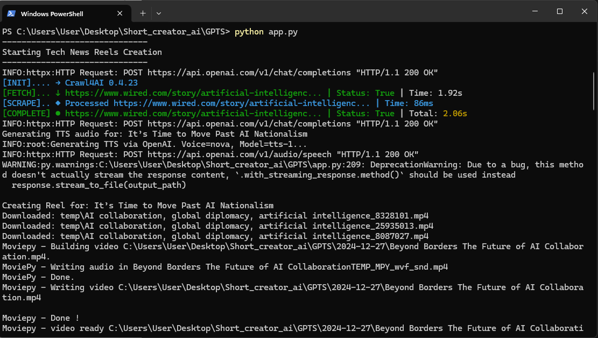

# GPTS – GPT Short Creator

**GPTS (GPT Short Creator)** is a Python-based tool that automatically generates short tech-news reels, featuring:

- **News retrieval** via [NewsAPI](https://newsapi.org/)
- **Text summarization** and **script generation** with the [OpenAI Chat Completions API](https://platform.openai.com/docs/api-reference/chat/)
- **Text-to-Speech** using the [OpenAI TTS API](https://platform.openai.com/docs/api-reference/audio/createSpeech)
- **Stock video material** from [Pexels](https://www.pexels.com/)
- **Final compilation** and **rendering** with [MoviePy](https://zulko.github.io/moviepy/)

## Key Features

- **Asynchronous Web Crawler**: Collects article URLs and extracts relevant content.
- **AI-driven Summaries**: Leverages GPT-based models to pick top articles and craft a concise script.
- **TTS Integration**: Uses OpenAI to generate high-quality voiceovers in MP3 format.
- **Automated Video Editing**: Retrieves multiple clips from Pexels, adds subtitles, merges everything into a final reel.

## Installation & Setup

1. **Clone the repository**:
   ```bash
   git clone https://github.com/your-account/gpts.git
   cd gpts
   ```

2. **Set up a virtual environment** (optional but recommended):
   ```bash
   python -m venv venv
   source venv/bin/activate     # Linux/Mac
   venv\Scripts\activate        # Windows
   ```

3. **Install dependencies**:
   ```bash
   pip install -r requirements.txt
   ```

4. **Configure environment variables** in a file named `.env`:
   ```bash
   OPENAI_API_KEY=your_openai_api_key
   NEWS_API_KEY=your_newsapi_key
   PEXELS_API_KEY=your_pexels_key
   ```
   
5. **ImageMagick**:
   - Make sure [ImageMagick](https://imagemagick.org) is installed and accessible, as MoviePy requires it for text rendering on clips.
   - change_settings({"IMAGEMAGICK_BINARY": r"C:\Program Files\ImageMagick-7.1.1-Q16-HDRI\magick.exe"})

## Usage

1. **Run the main script**:
   ```bash
   python app.py
   ```
2. The script automatically:
   - Fetches news articles from NewsAPI
   - Asks OpenAI for the top articles and a short script
   - Generates TTS audio from the script
   - Downloads matching stock videos from Pexels
   - Creates a short reel with subtitles and background audio
   - Outputs the final MP4 file in a date-based folder (e.g. `2025-01-01`)


## Examples

| Feature | Screenshot |
|---------|-----------|
| APP |  |
| TTS-Generierung | [TTS-Openai](temp/tts-openai.mp3) |
| Pexels-Download-1 | [Video 1](temp/AI-01.mp4) | 
| Pexels-Download-2 | [Video 2](temp/AI-02.mp4) |  
| Pexels-Download-3 | [Video 3](temp/AI-03.mp4) |
| MoviePy-Schnitt | [Final Video](2024-12-27/AI.mp4) |


## Example Flow

1. **Fetch**: Asynchronous crawler obtains article links and text.  
2. **Summarize**: GPT-based model picks top 5 articles and provides short scenes.  
3. **Voiceover**: OpenAI TTS converts text to audio.  
4. **Video Merging**: MoviePy cuts multiple clips, overlays subtitles, merges with the audio.  
5. **Final Output**: A short, shareable MP4 reel.

## Roadmap

- **Prompt Engineering** improvements for more tailored article summaries  
- **Customization** of TTS voices (allow user-specified voice & language)  
- **Docker Container** for easy deployment  
- **CLI Tools** for more flexible parameter control

## Todo

- **UI Expansion**: Create a graphical user interface to manage article selection, TTS voices, etc.  
- **Linux Pipeline**: Optimize the script for Linux-based environments, ensuring all dependencies are installed.  
- **Short Translation**: Offer reel subtitles or entire scripts in multiple languages, selectable in the UI.

## License

- GNU General Public License v2.0
